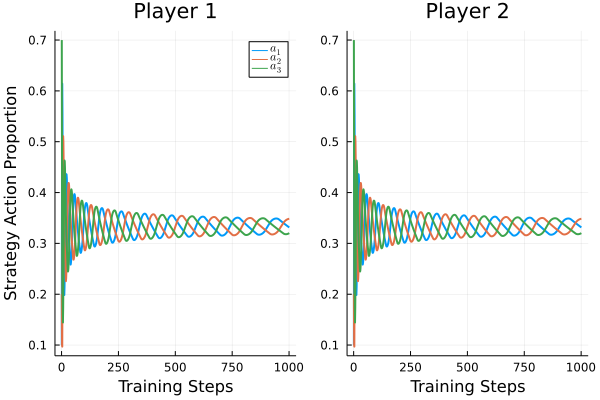
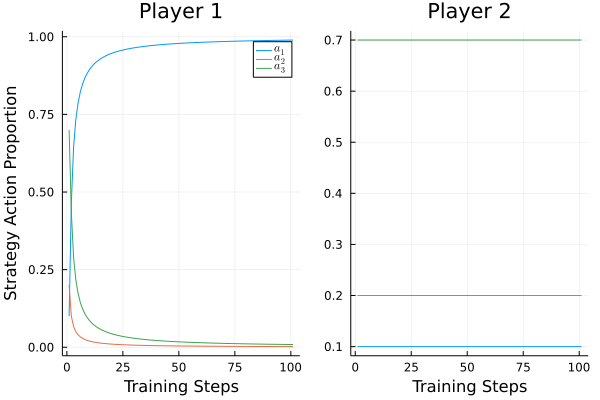

# HelloCFR

## Finding NE with Regret Matching
```julia
using HelloCFR
using Plots

RPS = MatrixGame([
    (0,0) (-1,1) (1,-1);
    (1,-1) (0,0) (-1,1);
    (-1,1) (1,-1) (0,0)
])

init_strategy = [0.1,0.2,0.7]

p1 = MatrixPlayer(RPS, 1, copy(init_strategy))
p2 = MatrixPlayer(RPS, 2, copy(init_strategy))

train_both!(p1, p2, 10_000)
plot(p1, p2, lw=2)
```


## Finding NE with CFR
```julia
game = SimpleIIGame([
    (0,0) (-1,1) (1,-1);
    (1,-1) (0,0) (-1,1);
    (-1,1) (1,-1) (0,0)
])

p1 = SimpleIIPlayer(game,1, [0.1,0.2,0.7])
p2 = SimpleIIPlayer(game,2, [0.1,0.2,0.7])

train_both!(p1,p2,1000)
plot(p1, p2, lw=2)
```


## Exploiting static opponent with CFR
```julia
p1 = SimpleIIPlayer(game,1, [0.1,0.2,0.7])
p2 = SimpleIIPlayer(game,2, [0.1,0.2,0.7])
train_one!(p1,p2,100)
plot(p1, p2, lw=2)
```

