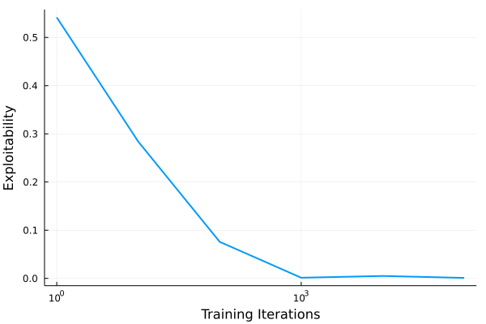

# CounterfactualRegret.jl

[](https://codecov.io/gh/WhiffleFish/CounterfactualRegret.jl)

## Implemented Solvers

| Solver Name   | Description        |
| ------------- | ------------------ |
| `CFRSolver`   | Vanilla CFR solver |
| `CSCFRSolver` | Chance Sampling    |
| `ESCFRSolver` | External Sampling  |
| `OSCFRSolver` | Outcome Sampling   |

Each solver takes optional kwarg `method`, which can be either `:vanilla`, `:plus`, or `:discount`, which correspond to Vanilla CFR, CFR+, and DCFR respectively.

## Solving a Matrix Game

```julia
using CounterfactualRegret
const CFR = CounterfactualRegret
using CounterfactualRegret.Games
using Plots

game = MatrixGame([
    (1,1) (0,0) (0,0);
    (0,0) (0,2) (3,0);
    (0,0) (2,0) (0,3);
])
sol = CFRSolver(game; debug=true)
cb = CFR.ExploitabilityCallback(sol, 10) # optional callback to monitor training
train!(sol, 10_000; cb=cb)
plot(sol)
plot(cb, lw=2)
```

| Strategy                                      | Exploitability                                |
| --------------------------------------------- | --------------------------------------------- |
|        |    |

## Finding Kuhn Poker Nash Equilibrium with external sampling & discounting

[Kuhn Poker Implementation & Game Definition Tutorial](src/games/Kuhn.jl)

```julia
game = Kuhn()
sol = ESCFRSolver(game; method=:discount, alpha=1.0, beta=1.0, gamma=1.0)
cb = CFR.ExploitabilityCallback(sol)
train!(sol, 100_001; cb=cb)

hist = cb.hist
exp_idxs = 10 .^(0:5) .+ 1
plot(
    hist.x[exp_idxs], hist.y[exp_idxs];
    xscale = :log10, lw=2, label="",
    xlabel = "Training Iterations",
    ylabel = "Exploitability"
)
```


